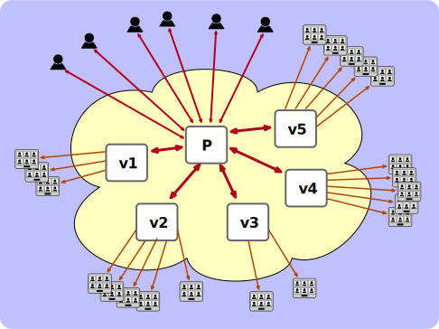

- Add to the enabled modules list in the general part (e.g. [here](https://github.com/bjc/prosody/blob/76bf6d511f851c7cde8a81257afaaae0fb7a4160/prosody.cfg.lua.dist#L33)):

service prosody restart
```

```
- Make sure you add the correct upstreams to nginx config

    keepalive 2;
    'polls.v1.meet.jitsi', 'polls.v2.meet.jitsi', 'polls.v3.meet.jitsi', 'polls.v4.meet.jitsi',
    ["v7.meet.jitsi"] = "tcp://127.0.0.1:52697";
    ["polls.v5.meet.jitsi"] = "tcp://127.0.0.1:52695";
```

-- allowed list of server-2-server connections
- a systemd unit file in `/lib/systemd/system/`
    ["conference.v6.meet.jitsi"] = "tcp://127.0.0.1:52696";
    ["polls.v8.meet.jitsi"] = "tcp://127.0.0.1:52698";
```
    ["conference.v8.meet.jitsi"] = "tcp://127.0.0.1:52698";

additional prosody vms are needed to support signaling to the audience.

hocon -f /etc/jitsi/jicofo/jicofo.conf set "jicofo.visitors.enabled" true
The script will add for each visitor prosody:
```
    ["polls.v7.meet.jitsi"] = "tcp://127.0.0.1:52697";
    ["polls.v2.meet.jitsi"] = "tcp://127.0.0.1:52692";
  admins = { "focus@auth.jitmeet.example.com" }

- a config entry in jicofo.conf
TODO:
service jicofo restart
    ["v8.meet.jitsi"] = "tcp://127.0.0.1:52698";
```

};
    ["polls.v1.meet.jitsi"] = "tcp://127.0.0.1:52691";
configured threshold will be just viewers (visitors) and there is no promotion
    ["v1.meet.jitsi"] = "tcp://127.0.0.1:52691"; -- needed for v1.meet.jitsi->visitors.jitmeet.example.com
    "conference.v5.meet.jitsi", "conference.v6.meet.jitsi", "conference.v7.meet.jitsi", "conference.v8.meet.jitsi",

eight cores are used to run prosody services for visitors, i.e., "visitor
`./pre-configure.sh 8`

    - In jitsi-meet nginx config make sure you have the conference-request location rules.
}
    'polls.v5.meet.jitsi', 'polls.v6.meet.jitsi', 'polls.v7.meet.jitsi', 'polls.v8.meet.jitsi'
    ["v6.meet.jitsi"] = "tcp://127.0.0.1:52696";
mechanism to become a main participant yet.
      "s2s_whitelist";
- a user for jicofo
To have a low-latency conference with a very large audience, the media and
visitor nodes.
  - You need to enable http requests to jicofo by editing config.js and adding a nginx rule for it. 
Now after the main 30 participants join, the rest will be visitors using the
    ["polls.v6.meet.jitsi"] = "tcp://127.0.0.1:52696";
    ["conference.v4.meet.jitsi"] = "tcp://127.0.0.1:52694";


Use the `pre-configure.sh` script to configure your system, passing it the
WARNING: This is still a Work In Progress
# Low-latency conference streaming to very large audiences
    server 127.0.0.1:52801;
* call duration
    - In /etc/jitsi/meet/jitmeet.example.com-config.js uncomment conferenceRequestUrl.
}
    ["conference.v5.meet.jitsi"] = "tcp://127.0.0.1:52695";
      "certs_s2soutinjection";
    ["v2.meet.jitsi"] = "tcp://127.0.0.1:52692";
    ["conference.v3.meet.jitsi"] = "tcp://127.0.0.1:52693";
vms (8+ cores). The main participants of a conference with a very large

-- targets must be IPs, not hostnames
To enable promotion where visitors need to be approved by a moderator to join the meeting:

# Configuration
  - you need to switch `auto_allow_visitor_promotion=false`.
    keepalive 2;
    zone upstreams 64K;
We consider 2000 participants per visitor node a safe value. So eight visitor
  You can add under main virtual host the config: `visitors_ignore_list = { "recorder.jitmeet.example.com" }` to ignore jibri and transcribers from the visitor logic and use them only in the main prosody conference.
    server 127.0.0.1:52802;
upstream v1 {
* Speaker stats
    ["conference.v2.meet.jitsi"] = "tcp://127.0.0.1:52692";
service nginx restart
- Enable `"visitors";` module under the main virtual host (e.g. [here](https://github.com/jitsi/jitsi-meet/blob/f42772ec5bcc87ff6de17423d36df9bcad6e770d/doc/debian/jitsi-meet-prosody/prosody.cfg.lua-jvb.example#L57))
```
signaling load must be spread  beyond what can be handled by a typical Jitsi
installation. A call with 10k participants requires around 50 bridges on decent
In the example configuration we use a 16 core machine. Eight of the cores are
    ["polls.v3.meet.jitsi"] = "tcp://127.0.0.1:52693";
After configuring you can set the maximum number of main participants, before
  auto_allow_visitor_promotion = true
    ["v5.meet.jitsi"] = "tcp://127.0.0.1:52695";

- Create the visitors component in /etc/prosody/conf.d/jitmeet.example.com.cfg.lua:
prosodies".
      "s2s_bidi";
s2sout_override = {
- folders in `/etc/`
If using older than Prosody 0.12.4 you need to apply the patch - s2sout_override1.patch and s2sout_override2.patch.
      "s2sout_override";
Component "visitors.jitmeet.example.com" "visitors_component"
redirecting to visitors.
- Make sure s2s is not in modules_disabled
    zone upstreams 64K;
* Polls
used for the main prosody and other services (nginx, jicofo, etc) and the other
- Add the following config also in the general part (matching the number of prosodies you generated config for):
```
s2s_whitelist = {
prosodies will be enough for one 10k participants meeting.
    "conference.v1.meet.jitsi", "conference.v2.meet.jitsi", "conference.v3.meet.jitsi", "conference.v4.meet.jitsi",
```
number of visitor prosodies to set up.
hocon -f /etc/jitsi/jicofo/jicofo.conf set "jicofo.visitors.max-participants" 30
    ["conference.v7.meet.jitsi"] = "tcp://127.0.0.1:52697";
```
upstream v2 {
}
Setting up configuration for the main prosody is a manual process:
The final implementation may diverge. Currently, only the participants after a
    ["conference.v1.meet.jitsi"] = "tcp://127.0.0.1:52691";
    ["polls.v4.meet.jitsi"] = "tcp://127.0.0.1:52694";
```
    ["v4.meet.jitsi"] = "tcp://127.0.0.1:52694";
Now restart prosody and jicofo
    ["v3.meet.jitsi"] = "tcp://127.0.0.1:52693";

audience will share a main prosody, like with normal conferences, and
```
